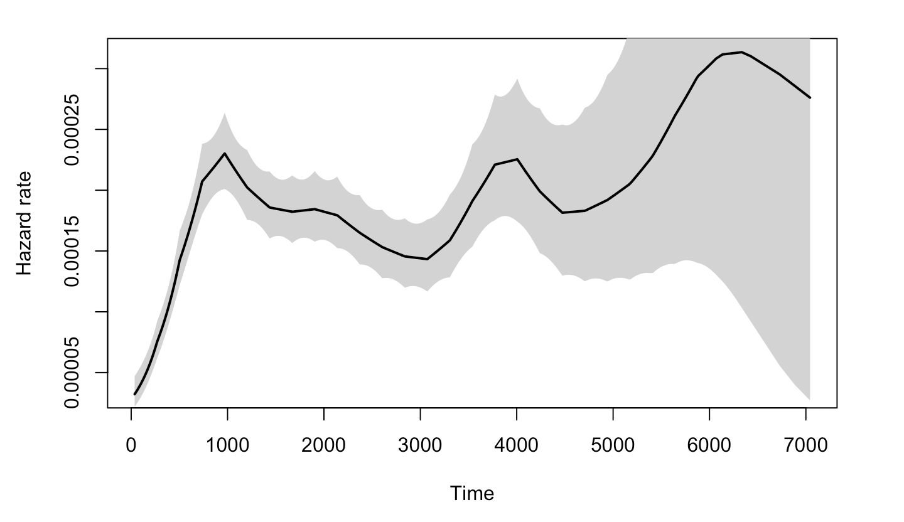
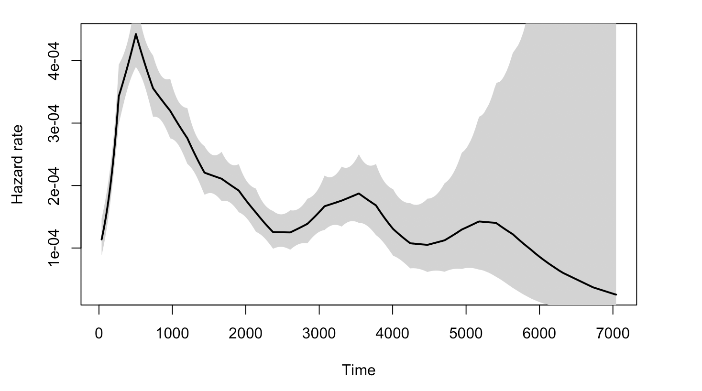

# Survival Analysis

```{r, echo=FALSE,warning=FALSE,message=FALSE,include=FALSE}
library(survival)
library(survminer)
library(tidyverse)
library(caret)
```

## Notation

```{r, echo=FALSE,warning=FALSE,message=FALSE,include=FALSE}
data(cancer, package="survival")
```

```{r, echo=FALSE,warning=FALSE,message=FALSE,include=FALSE}
rotterdam <- rotterdam %>%
  mutate(Treatment = ifelse(chemo == 1 & hormon == 0, "Chemo", 
                     ifelse(chemo == 0 & hormon == 1, "Hormon", 
                     ifelse(chemo == 1 & hormon == 1, "Both", "NaN/Other Treatment")))) %>% 
  mutate(Treatment = as.factor(Treatment))

rotterdam <- rotterdam %>% 
  mutate(Nodes_level = ifelse(nodes == 0, "N0", 
                       ifelse(nodes >= 1 & nodes <= 3, "N1", 
                       ifelse(nodes >= 4 & nodes <= 9, "N2", 
                       ifelse(nodes >= 10, "N3", NaN))))) %>% 
  mutate(Treatment = as.factor(Treatment))

rotterdam <- rotterdam %>%
  mutate(grade = as.factor(grade)) %>%
  mutate(size = as.factor(size)) %>%
  mutate(Treatment = as.factor(Treatment))

rotterdam_recur <- rotterdam %>%
  filter(recur == 1) %>%
  mutate(drecurtime = dtime-rtime)
```

In survival analysis, there is an important concept called "censoring". Censoring is a kind of missing data problem where an event is not completely observed, for reasons like termination of study or loss of communication with the participant. And censoring will cause the observed time data inaccurate. For instance, for left-censored data, we don't know the exact value of the data point, but only an upper bound for it; And for right-censored data, we only knows a lower bound for it. 

In our dataset `rotterdam`, for the time variable `dtime` and `rtime` that we are curious about, `death` and `recur` are the corresponding variable that records if censoring occured. Since if someone is dead in this study, this means that the survival time we observed is exact; But for someone is still alive in the end of the study, the survival time we observed is just a lower bound. And similarly, if someone suffers from recurrent breast cancer during the study, our `rtime` should be accurate; But for someone did not encounter recurrence of breast cancer in the study, we are not sure if she will encounter in the future, so the data point is also a lower point.

For all the survival analysis below, we will include `death` and `recur` to examine the relationship between `dtime` and `rtime` vs. the diagnostic information and treatment received. 

## Kaplan-Miere estimator of the entire dataset

Generally speaking, Kaplan-Miere curve is a non-parametric estimator of the survival function which takes censoring into account. Its y-axis measures $P(X \leq k)$ for various values of $k$. 

#### Death Time
```{r}
KM_d <- survfit(Surv(dtime, death) ~ 1, data = rotterdam)
plot(KM_d, conf.int = TRUE, xlab="Days", ylab="Survival")
```

Kaplan-Meier curve also helps us finding the median and mean estimate. For median, we can directly find it from the survfit object `KM_d`. For mean, we need to calculate the area under the Kaplan-Meier curve.

```{r}
# median
KM_d
```

```{r}
# mean

# AUCKM stands for "Area Under Curve Kaplan Meier":
AUCKM = function(survobj,duration)
{
base=c(0,summary(survobj)$time,max(duration))
heights=c(1,summary(survobj)$surv)
new=c()
for(i in 1:length(heights)) { new=c(new,(base[i+1]-base[i])*heights[i]) }
c(sum(new))
}

AUCKM(KM_d,rotterdam$dtime)
```

The overall mean survival time till death for breast cancer is 4099.795 days, and the overall median survival time till death for breast cancer is 4033 days. Both of them are approximately 7 years.

We can find that the mean and median we calculated above is much longer than the mean and median of the variable `dtime` itself, because a lot of data point are right-censored:

```{r}
mean(rotterdam$dtime)
median(rotterdam$dtime)
```


#### Recurrence Time

```{r}
KM_r <- survfit(Surv(rtime, recur) ~ 1, data = rotterdam)
plot(KM_r, conf.int = TRUE, xlab="Days", ylab="Survival")
```

We can find the mean and median in a similar way:

```{r}
# median
KM_r
```

```{r}
# mean

AUCKM(KM_r,rotterdam$rtime)
```

The overall mean survival time till recurrence for breast cancer is 3588.535 days, which is approximately 10 years. The overall median survival time till recurrence for breast cancer is 2983 days, which is approximately 8 years. Notice here our mean is much greater than the median, and this indicates that our `rtime` should be right-skewed.

```{r}
ggplot(rotterdam, aes(x=rtime)) +
   geom_density() 
```

#### Survival time after recurrence

```{r}
KM_dr <- survfit(Surv(drecurtime, death) ~ 1, data = rotterdam_recur)
plot(KM_dr, conf.int = TRUE, xlab="Days", ylab="Survival")
```

```{r}
# median
KM_dr
```

```{r}
# mean

AUCKM(KM_dr,rotterdam_recur$drecurtime)
```

The overall mean survival time after rucurrence till death for breast cancer is 1407.135 days, which is approximately a little less than 4 years. The overall median survival time after rucurrence till death for breast cancer is 894 days, which is approximately 2 years and a half. Here, the mean is also greater than the median, also indicating right-skewness:

```{r}
ggplot(rotterdam_recur, aes(x=drecurtime)) +
   geom_density() 
```

Since a Kaplan-Miere estimator is unbiased, we could view the mean and median as being very close to the true value of survival time. 

## Kaplan-Miere estimator on different variables in `rotterdam`

There are 16 variables in the `rotterdam` dataset. Of course we could have fit each variable with a KM estimator, but it would be meaningless to do them all. We will stick to the Diagnostics and Treatment we mentioned in Chapter 2 and fit `size`, `Nodes_level`(we are not using nodes because a Kaplan-Miere estimator does not work well with quantitative variables), `grade` and `Treatment` each with KM estimators with respect to `dtime`, `rtime`, and `drecurtime` to grasp the survival time within each categories of the variables.

### `size` vs. Survival Times

`size` vs. `dtime`
```{r}
KM_None_Death <- survfit(Surv(dtime, death) ~ size, data = rotterdam)
plot(KM_None_Death, conf.type = "plain", col = c("black","red","blue"), xlab="Days", ylab="Survival")
legend(6000, 1, legend=c("<=20", "20-50", ">50"),
       col=c("black", "red", "blue"), lty=1, cex=0.8,
       title="Tumor Size", text.font=6)
```

`size` vs. `rtime`
```{r}
KM_None_Recur <- survfit(Surv(rtime, recur) ~ size, data = rotterdam)
plot(KM_None_Recur, conf.type = "plain", col = c("black","red","blue"), xlab="Days", ylab="Survival")
legend(6000, 1, legend=c("<=20", "20-50", ">50"),
       col=c("black", "red", "blue"), lty=1, cex=0.8,
       title="Tumor Size", text.font=6)
```

In general, patients with smaller tumor at diagnosis enjoys longer survival for both death and recurrence.

```{r}
KM_None_drecur <- survfit(Surv(drecurtime, death) ~ size, data = rotterdam_recur)
plot(KM_None_drecur, conf.type = "plain", col = c("black","red","blue"), xlab="Days", ylab="Survival")
legend(4500, 1, legend=c("<=20", "20-50", ">50"),
       col=c("black", "red", "blue"), lty=1, cex=0.8,
       title="Tumor Size", text.font=6)
```

The trend is still the same as patients with smaller tumor size enjoy longer survival of death after recurrence, but the survival time now decreases much faster for all groups.

### `Nodes_level` vs. Survival Times

`Nodes_level` vs. `dtime`
```{r}
KM_None_Death <- survfit(Surv(dtime, death) ~ Nodes_level, data = rotterdam)
plot(KM_None_Death, conf.type = "plain", col = c("black","red","blue","orange"), xlab="Days", ylab="Survival")
legend(6000, 1, legend=c("N0", "N1","N2", "N3"),
       col=c("black", "red", "blue", "orange"), lty=1, cex=0.8,
       title="Nodes_level", text.font=6)
```

`Nodes_level` vs. `rtime`
```{r}
KM_None_Recur <- survfit(Surv(rtime, recur) ~ Nodes_level, data = rotterdam)
plot(KM_None_Recur, conf.type = "plain", col = c("black","red","blue","orange"), xlab="Days", ylab="Survival")
legend(6000, 1, legend=c("N0", "N1","N2", "N3"),
       col=c("black", "red", "blue", "orange"), lty=1, cex=0.8,
       title="Nodes_level", text.font=6)
```

In general, patients with less nodes tested positive will enjoy longer survival for both death and recurrence.

`Nodes_level` vs. `drecurtime`
```{r}
KM_None_drecur <- survfit(Surv(drecurtime, death) ~ Nodes_level, data = rotterdam_recur)
plot(KM_None_drecur, conf.type = "plain", col = c("black","red","blue","orange"), xlab="Days", ylab="Survival")
legend(4500, 1, legend=c("N0", "N1","N2", "N3"),
       col=c("black", "red", "blue", "orange"), lty=1, cex=0.8,
       title="Nodes_level", text.font=6)
```

Similarly, the trend is still the same as patients with fewer nodes tested positive enjoy longer survival of death after recurrence, but the survival time now decreases much faster for all groups, and the difference is small in groups `N1`, `N2` and `N3`.

### `grade` vs. Survival Times

`grade` vs. `dtime`
```{r}
KM_None_Death <- survfit(Surv(dtime, death) ~ grade, data = rotterdam)
plot(KM_None_Death, conf.type = "plain", col = c("black","red"), xlab="Days", ylab="Survival")
legend(6000, 1, legend=c("2", "3"),
       col=c("black", "red"), lty=1, cex=0.8,
       title="grade", text.font=6)
```

`grade` vs. `rtime`
```{r}
KM_None_Recur <- survfit(Surv(rtime, recur) ~ grade, data = rotterdam)
plot(KM_None_Recur, conf.type = "plain", col = c("black","red"), xlab="Days", ylab="Survival")
legend(6000, 1, legend=c("2", "3"),
       col=c("black", "red"), lty=1, cex=0.8,
       title="Nodes_level", text.font=6)
```

`grade` vs. `drecurtime`
```{r}
KM_None_drecur <- survfit(Surv(drecurtime, death) ~ grade, data = rotterdam_recur)
plot(KM_None_drecur, conf.type = "plain", col = c("black","red"), xlab="Days", ylab="Survival")
legend(4500, 1, legend=c("2", "3"),
       col=c("black", "red"), lty=1, cex=0.8,
       title="Nodes_level", text.font=6)
```

Similarly, we find that patients with grade 2 breast cancer show clear distinction in both the survival of death and recurrence. However, such distinct becomes less obvious for the survival of death after recurrence has occurred.

### `Treatment` vs. Survival Times

`Treatment` vs. `dtime`
```{r warning=FALSE}
KM_Treatment_Death <- survfit(Surv(dtime, death) ~ Treatment, data = rotterdam)
plot(KM_Treatment_Death, conf.int = FALSE, col = c("black", "red", "blue", "orange"), xlab="Days", ylab="Survival")
legend(1, 0.4, legend=c("Both", "Chemo","Hormon", "NaN/Other Treatment"),
       col=c("black", "red", "blue", "orange"), lty=1, cex=0.8,
       title="Treatment Group", text.font=6)
```

`Treatment` vs. `rtime`
```{r}
KM_Treatment_Recur <- survfit(Surv(rtime, recur) ~ Treatment, data = rotterdam)
plot(KM_Treatment_Recur, conf.int = FALSE, col = c("black", "red", "blue", "orange"), xlab="Days", ylab="Survival")
legend(1, 0.4, legend=c("Both", "Chemo","Hormon", "NaN/Other Treatment"),
       col=c("black", "red", "blue", "orange"), lty=1, cex=0.8,
       title="Treatment Group", text.font=6)
```

As we have discussed in Chapter 2, we know that generally chemotherapy is used on patients with age lower than 50 years old and hormontherapy is used on patients with age higher than 50 years old. Based on the difference of treatment, we could see that chemotherapy has a better effect than hormontherapy with respect to death time and a smaller yet still better effect regarding the recurrence time.

`Treatment` vs. `drecurtime`
```{r}
KM_Treatment_drecur <- survfit(Surv(drecurtime, death) ~ Treatment, data = rotterdam_recur)
plot(KM_Treatment_drecur, conf.int = FALSE, col = c("black", "red", "blue", "orange"), xlab="Days", ylab="Survival")
legend(3700, 1, legend=c("Both", "Chemo","Hormon", "NaN/Other Treatment"),
       col=c("black", "red", "blue", "orange"), lty=1, cex=0.8,
       title="Treatment Group", text.font=6)
```

However, sadly enough, from the above plot we could see that no matter what treatment a patient use, it does not make a difference for the death survival time after cancer cells have recurred. This matches our conclusion from the visualization in Chapter 2.

## Parametric Models

Another point that we are going to explore is if we would be able to fit our data to a parametric model. This matters since if we could fit any parametric model, then we should have a model good enough to generate predictions of breast cancer patients' survival and would have nice and interpretable coefficients to work with.

To do so, we will begin by checking if any of Exponential, Weibull, or Log-normal distribution would be adequate parametric assumption to cast on our data. We will verify the adequacy by checking the Cox-Snell residual plot. We will be fitting models using variables: `Treatment`, `size`, `nodes`, `grade`, `age` (we have shown in Chapter 2 that age is a confounder for categories in Treatment).

### User-defined Cox-Snell function

If we fit Exponential model on the survival time, we have the function $S(t) = e^{-\lambda t}$, and we can transform the survival function into an expression for the “complementary log-log”:

\begin{align*}
S(t) &= e^{-\lambda t} \\
\log[S(t)] &= -\lambda t \\
-\log[S(t)] &= \lambda t \\
\log\big(-\log[S(t)] \big) &= \log\lambda + \log t
\end{align*}

Then, if we let $y=\log\big(-\log[S(t)] \big)$, $m=1$, $b=\log(\lambda)$, and $x=\log(t)$, then we can view the equation in the form $y=mx+b = 1*x+b$.

This means that if Exponential model is adequate, its complementary log-log plot should be a linear line with slope=1 and intercept=0.

And for any other parametric model, we can define a Cox-Snell residual as $CS_i = -log(\hat{S}_p(t_i|x_i))$ for $i=1,\dots, n$, and $CS_i$s should behave like data drawn from an Exponential distribution ($\lambda=1$).

Thus, we can check the adequacy of any model by checking the Exponential-ness of its Cox-Snell residuals. We can graph $CS_i$ vs $log(CS_i)$, and the graph should also look linear with slope =1 and intercept=0, if the parametric model is adequate for the data.

```{r}
# The Cox-Snell function takes as inputs
# 1. A vector of Cox-Snell residuals created by the user based on the model being evaluated,
# 2. A status vector
# 3. Optional x- and y- limits for the resulting plot

CoxSnell = function(cs,status,xlim=NULL,ylim=NULL)
{
kmcs = survfit(Surv(jitter(cs,amount=(max(cs)-min(cs))/1000),status) ~ 1)$surv

plot(log(-log(kmcs)) ~ sort(log(cs)) ,
      xlab="log(Cox-Snell)", ylab="log(-log(S(Cox-Snell)))", xlim=xlim, ylim=ylim )

abline(0,1,col='red')
}
```

### Exponential and Weibull

We first tried to examine the adquacy of Exponential and Weibull model, but none of them are adquate for our dataset:

1. `dtime, death ~ Treatment + size + nodes + grade + age` under Exponential:

```{r,warning=FALSE,message=FALSE}
Dexp <- survreg(Surv(dtime, death) ~ Treatment + size + nodes + grade + age, dist='exponential', data=rotterdam)
Dexp
```


2. `rtime, recur ~ Treatment + size + nodes + grade + age` under Exponential:

```{r, warning=FALSE}
Rexp <- survreg(Surv(rtime, recur) ~ Treatment + size + nodes + grade + age, dist='exponential', data=rotterdam)
Rexp
```


3. `dtime, death ~ Treatment + size + nodes + grade + age` under Weibull:

```{r}
Dweibull <- survreg(Surv(dtime, death) ~ Treatment + size + nodes + grade + age, dist='weibull', data=rotterdam)
Dweibull
```


4. `rtime, recur ~ Treatment + size + nodes + grade + age` under Weibull:

```{r}
Rweibull <- survreg(Surv(rtime, recur) ~ Treatment + size + nodes + grade + age, dist='weibull', data=rotterdam)
Rweibull
```


### Log-normal models

Finally, we will examine the adequacy of Log-normal model.

```{r}
Dlnorm <- survreg(Surv(dtime, death) ~ Treatment + size + nodes + grade + age , dist='lognormal', data=rotterdam)
summary(Dlnorm)
CS_LnormD <- -log(1 - plnorm(rotterdam$dtime, 9.91512622-0.42502769*(rotterdam$Treatment=="Chemo")
                                                  -0.31448004*(rotterdam$Treatment=="Hormon")  
                                                  -0.41616843*(rotterdam$Treatment=="NaN/Other Treatment")
                                                  -0.34787441*(rotterdam$size=="20-50")
                                                  -0.60916461*(rotterdam$size==">50")
                                                  -0.07772719*rotterdam$nodes
                                                  -0.30866307*(rotterdam$grade=="3")
                                                  -0.01004650*rotterdam$age, 
                                       1.06897))
# Make appropriate graph using CoxSnell function
CoxSnell(CS_LnormD, rotterdam$death)
```

```{r}
Rlnorm <- survreg(Surv(rtime, recur) ~ Treatment + size + nodes + grade + age, dist='lognormal', data=rotterdam)
summary(Rlnorm)
CS_LnormR <- -log(1 - plnorm(rotterdam$rtime, 8.78912009-0.36138607*(rotterdam$Treatment=="Chemo")
                                                  -0.41809135*(rotterdam$Treatment=="Hormon")   
                                                  -0.58077716*(rotterdam$Treatment=="NaN/Other Treatment")
                                                  -0.41865655*(rotterdam$size=="20-50")
                                                  -0.67178824*(rotterdam$size==">50")
                                                  -0.10590430*rotterdam$nodes 
                                                  -0.43987388*(rotterdam$grade=="3")
                                                  +0.00892277*rotterdam$age, 
                                      1.327904))

# Make appropriate graph using CoxSnell function
CoxSnell(CS_LnormR, rotterdam$recur)
```

We could see that the Log-normal parametric model is an adequate model for both the `dtime` and `rtime` vs. `Treatment` + `size` + `nodes` + `grade` + `age`.

#### Interpretation of the coefficients

Lognormal is an example of a class of models called Accelerated Failure Time (AFT) models, in which every 1-unit increase in $x_i$ is associated with a scaling of time by $e^{c_i}$, where $c$ is the coefficient of $x$ in the regression model. The quantity $e^{c_i}$
is referred to as a time ratio (TR), and thus each $c_i$ represents a log(TR).

Thus, the results of our lognormal model can be interpreted in the following way:

##### For `dtime`:

```{r}
exp(-0.42502769) # chemo
exp(-0.3144800) # hormon
exp(-0.41616843) # NaN/Other Treatment
exp(-0.34787441) # size 20-50
exp(-0.60916461) # size >50
exp(-0.07772719) # nodes
exp(-0.30866307) # grade 3
exp(-0.01004650) # age
```

Having chemotherapy, hormon-therapy and NaN/Other Treatment is associated with a scaling of mean survival time by 0.6537517, 0.7301685 and 0.6595692 respectively, compared to having both chemo and hormon therapies. However, the relationships are all insignificant.

Compared to tumor size <=20mm, having tumor size 20-50mm and >50mm will make the expected survival time scaled by 0.7061876 and 0.543805.

For node and age, each extra positive lymph nodes and every 1-year increase in age is associated with a scaling of mean survival time by 0.9252168 and 0.9900038. 

And compared to grade II, grade III of cancer cell makes the expected survival time multiplied by 0.7344282.

##### For `rtime`:

```{r}
exp(-0.36138607) # chemo
exp(-0.41809135) # hormon
exp(-0.58077716) # NaN/Other Treatment
exp(-0.41865655) # size 20-50
exp(-0.67178824) # size >50
exp(-0.10590430) # nodes
exp(-0.43987388) # grade 3
exp(0.00892277) # age
```

Having chemotherapy, hormon-therapy and NaN/Other Treatment is associated with a scaling of mean time till recurrence by 0.69671, 0.6583021 and 0.5594634 respectively, compared to having both chemo and hormon therapies. And the relations here are also insignificant.

Compared to tumor size <=20mm, having tumor size 20-50mm and >50mm will make the expected survival time scaled by 0.6579301 and 0.5107943.

For node and age, each extra positive lymph nodes and every 1-year increase in age is associated with a scaling of mean survival time by 0.8995107 and 1.008963. 

And compared to grade II, grade III of cancer cell makes the expected survival time multiplied by 0.6441177.
 

#### Why log-normal

As to why the Log-normal model would be suitable for the data, we are not sure. One thing to consider is that the non-monotonicity of the hazard function, which is one main characteristic of log-normal model compared to Exponential and Weibull.

The plot below graphs the general hazard functions of our `dtime` and `rtime` in a non-parametric way, and we can find that both of them shows non-monotonicity. Though we cannot graph the exact hazard functions conditioning on the diagnostic and treatment information, the non-parametric hazard can still partially explain the adquacy of log-normal.






#### Positive coefficient of `age`

In the `rtime ~ Treatment + size + nodes + age` models, it is surprised to see that the coefficient of `age` is positive, though the value is small. One possible explanation could be the idea of "competing events" and "competing risk".

In this scenario, having recurred breast cancer and being dead could be somewhat "competing events". Though they are not completely "cannot happen on one person at the same time", it is still reasonable to think that for older patients, it is more likely to die from breast cancer or other complications than being cancer-free for years and then having breast cancer recurred; whereas for younger people, the risk of having recurrent breast cancer could be higher than being dead from the first breast cancer.

```{r}
rotterdam_new <- rotterdam %>% 
  mutate(state = ifelse(death == 1 & recur == 0, "death",
                 ifelse(death == 0 & recur == 1, "recur", 
                 ifelse(death == 1 & recur == 1, "both", "neither"))))

ggplot(rotterdam_new, aes(x=age, color=state, fill=state)) +
  geom_density(alpha=0.3)
```

The plot above also helps verifying the idea. We can find that the group who has been dead during the study but has never had breast cancer recurred (the green one) tends to be older than others.

The positive coefficient of `age` in the log-normal model may seem indicating a protective effect of being old against having breast cancer recurred, but this should not be the true case. It is very likely that this is caused by the competing risk between being dead and having breast cancer recurred for people in different age group. The elderly patients are less likely to suffer from recurrent breast cancer because they are more likely to die from breast cancer or other complications during the treatment after the first diagnosis.

## Cox-PH model:

Another very important part of a survival analysis is looking for the hazard ratio by building and interpreting the coxph model. 

Cox’s PH model assumes that the hazard function for any subject can be written as: $h(t) = h_0(t)e^{b_1 x_1 + b_2 x_2 + \dots + b_k x_k}$,
where $h_0(t)$ is called a baseline hazard function, and the $x_i$'s are covariates. The Cox PH model assumes that, for any 2 values
of a covariate, the hazard ratio (HR) is constant over time.

With this model, once we have proof of the validation of the PH assumption of the model, we could have nice coefficients to interpret as the logarithm of HR(hazard ratio) among different groups. We will be following the way that we built our parametric models, by using Survival times vs. `age` + `size` + `nodes` + `grade` + `Treatment`.

### Cox-PH model for `dtime`

```{r}
m_death_withage = coxph(Surv(dtime, death) ~ Treatment + size + nodes + grade + age, data=rotterdam)
m_death_withage
```

First we should check if the PH assumption holds. We will be using a formal test.

```{r}
cox.zph(m_death_withage)
```

There are two variables, `age` and `nodes`, that have have p-value smaller than 0.05, which indicates the violation of the PH assumption.

One way we came up to solve this problem is to put stratification on `age` and `nodes` by putting a `strata()` on them when fitting the model. What this does is to recognize the correlation between `age` and `dtime` and `nodes` and `dtime`, but not actually including them in our model results. 

```{r}
m_death_strataage = coxph(Surv(dtime, death) ~ Treatment + size + strata(nodes) + grade + strata(age), data=rotterdam)
m_death_strataage
cox.zph(m_death_strataage)
```

Now we can see that all the variables' p-value are greater than 0.05 which indicates the PH assumption holds in our model. 

For treatments, we can see that Chemotherapy, Hormontherapy and Other Treatment all have higher risks than patients receiving both therapies, with hazard ratio 1.57808, 1.56706 and 2.14035 respectively. However, note that all three p-values are greater than 0.05, which means that we do not have significant evidence for such relationships. 

And for size, it is clear that patients with larger tumor size enjoy higher risks, and as the size grows, the risk is also increasing, with hazard ratio 1.53977 and 1.88536 for 20-50mm vs. <=20mm and >50mm vs. <=20mm. Such relationship is significant as we can see from the p-values since they are all less than 0.05.

For grade, we could see that the risk is going to be multiplied by 1.46358, if it goes from grade II to grade III, and the relation is staitstically significant.

### Cox-PH model for `rtime`

```{r}
m_recur = coxph(Surv(rtime, recur) ~ Treatment + strata(size) + strata(nodes) + strata(grade) + age, data=rotterdam)
m_recur
```

For `rtime`, we found that all the diagnostic information `size`, `nodes` and `grade` obeys the PH assumption, and we can only investigate `Treatment` and `age`.

We can find that patients taking both chemo and hormon therapies still have lowest hazard of breast cancer recurrence, and having chemo only, hormon only or NaN/Other Treatment will multiply the hazard by 1.323703, 1.485958 and 2.264464 respectively. However, the statistical significance is not that strong.

And for age, it's still surprised to see that its coefficient is negative, indicating that every 1-year increase in age will make the hazard of breast cancer recurrence by 0.984741. The reason behind this should be the same as the idea of competing risk we mentioned above. 


## Summary

Based on all the survival analysis above, we found that different treatment ways actually does not differ significantly in extending patients' survival time or time till recurrence, and the main factors that affect patients' life are the diagnostic information: tumor size, number of positive lymph nodes and tumor grade. 

This reminds us the importance of taking screening every three years. Current medical level still fails to cure breast cancer, but with early diagnosis, patients' lives can be extended by a lot. 


